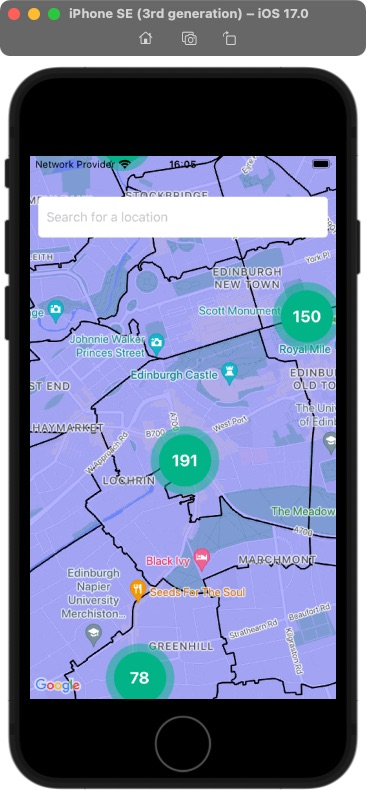
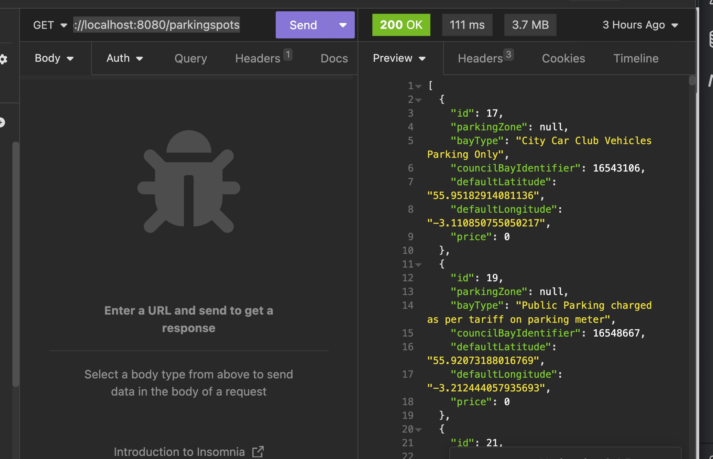

# Smart Park

## Summary
iOS app that shows bicycle and car parking information for Edinburgh

## Description
The Edinburgh City Council has parking information up on the council website but this is not very easy to find or accessible. We wanted to proovide an easy app that would show parking spots and their costs and relevant information, but also show bicyle parking spots to promote cycling instead of taking the car. 

## Technical Architecture:
The app is based on a data layer (ParkingData) that manages the data, a web server layer (ParkingServer) to serve out the data and the actual Smart Park iOS app.  

ParkingData is a Python application built to process data from publicly available APIs and uses a Postgresql database to store the data that the SmartParkapp will consume. The ParkingServer is built in Java Spring and provides routes to access this data. The SmartPark app is built in React Native and uses Google maps. 

### Prerequisites:
To be able to run the entire project the following will need to be installed on your machine:
- Python 3.11 
- SQLAlchemy 2.0.20
- PyMongo 4.6.0
- MongoDB 6.0.10 Community
- PostgresQL 14.10
- Java 17
- Spring 3.1.6 (*Spring Web*, *Spring Boot DevTools*, *Spring Data JPA*, *PostgresSQL Driver*)
- Intellij IDEA Community Edition (or your own favourite java IDE)
- Xcode
- Expo Go *on your phone*
    

## Installation Instructions:
1.  Create a project directory, for example `mkdir SmartPark``
2.  First ParkingData needs to be installed in the project directory. Please follow the detailed instructions from the [Readme]  (https://github.com/LidzDev/ParkingData)
3. Next install the ParkingServer in the project directory. Please follow the detailed instructions from the [Readme]  (https://github.com/Andy-brown87/ParkingServer)
4. Finally install the app in the project directory. Please follow the detailed instructions from the [Readme] (https://github.com/DarrenLackie/parking_app_frontend)
     
## How to use it

1. Make sure the parking database is running and that you have ran the seed scripts. You can use a tool like [postico](https://eggerapps.at/postico2/). You should see some tables with data in the parking database called:
    `bicycle_spots, hours, parking_spots, parking_zones, spot_coordinates, vehicles, zone_coordinates`
2. Make sure the webserver is installed and running on port 8080. If you use [Intellij](https://www.jetbrains.com/idea/download/), you can stop and start the server in the Application
3. You can use a tool like [insomnia](https://insomnia.rest/products/insomnia) to test the routes. You should get some results when you [check](http://localhost:8080/parkingspots)
4. Make sure the front end client is running

## What it looks like

### Credits 

- [Claire Martin] (https://github.com/cemmartin)
- [Darren Lackie] (https://github.com/DarrenLackie)
- [Lydia Cordell] (https://github.com/LidzDev)
- [Andrew Brown] (https://github.com/andy-brown87)
